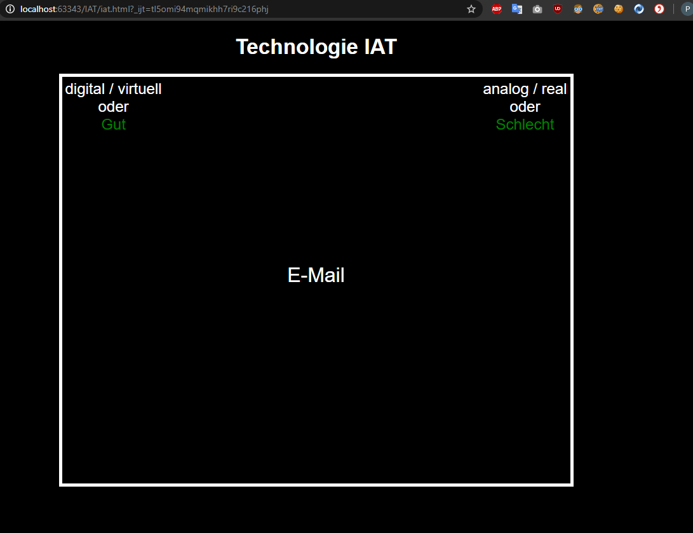

# Bachelor thesis - Fake implicit association test (IAT)

- I programmed a fake implicit association test I used as a manipulation in my research design for my empirical bachelor thesis in the field of psychology
- topic german: Inwiefern lassen sich Einstellung und Verhalten im Kontext der digitalen Transformation durch eine Manipulation der Selbstwirksamkeitserwartung positiv verändern?
- topic english: To what extent can attitudes and behavior in the context of the digital transformation by manipulating self-efficacy be changed positively?

- language: german

